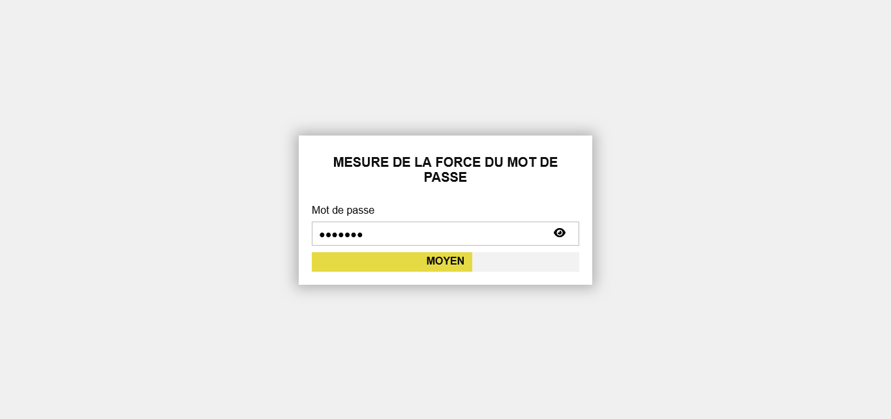

## MESURE DE LA FORCE D'UN MOT DE PASSE

## Le challenge

Ce projet permet à un internaute de mesure la force de son mot de passe. Ce compteur contient 5 niveaux et 3 étapes pour visualiser la force du mot de passe. Enfin, l'utilisateur a la possibilité d'afficher et de cacher le mot de passe.

## Démonstration

Lien vers le projet : https://aperbet56.github.io/password_strength_meter/

## Projet développé avec

- Utilisation des balises sémantiques HTML5
- CSS3
- Flexbox
- Utilisation d'un normaliseur : le fichier normalize.css
- Page web responsive
- Desktop first
- JavaScript
- Code JavaScript commenté
